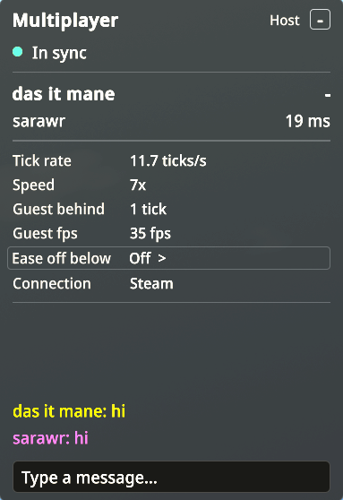

# BeaverBuddies Stability Fork

Multiplayer co-op for Timberborn: build one colony together in real time, with **Steam friend invites**, an
**in-game connection panel** and a long list of crash and desync fixes.

   

**[Download](https://github.com/timbermods/BeaverBuddies-Stability-Fork/releases/latest)** · [Install](#install) · [Website](https://timbermods.github.io/BeaverBuddies-Stability-Fork/) · [Changelog](STABILITY-CHANGELOG.md) · [More mods from Timbermods](https://timbermods.github.io/)

> [!NOTE]
> **Stable and feature-complete.** 1.1.15 has been played and works. The fork still gets fixes and updates for new
> Timberborn versions, but no new features: those go into
> [Timber Together](https://github.com/timbermods/TimberTogether), which is built on this fork and
> can also give each player a colony of their own. Install one or the other, never both.

An independent fork of [BeaverBuddies](https://github.com/thomaswp/BeaverBuddies) by thomaswp and contributors, the
original multiplayer mod. Everything the original does still works: one shared colony built in real time, each player
with their own camera, multi-start maps, map pings, and hosting and joining from the game's menus. Please report
problems with this fork [here](https://github.com/timbermods/BeaverBuddies-Stability-Fork/issues), not to the
original project.

## What you get

- **Steam invites.** Invite a friend from Steam's overlay and they join with a click: no port forwarding, no Hamachi.
  Direct IP still works too.
- **A connection panel.** Who is connected, each player's ping, whether you're in sync, the tick rate and a chat box,
  in a small panel you can collapse, move or hide.
- **Fewer crashes and desyncs.** Fixes for water, animation, random numbers, saving, demolition, Wonders, input and
  network problems. They remove known causes; a desync can still happen.
- **Teammates' cursors.** See where your friends are pointing and what they're editing, in colours you choose.
- **A low ping at high speed.** Over Steam the ping stays low even at speed 7.
- **The host can ease off for a slow guest**, and choose to run the full chosen speed in a large colony (off by
  default).
- **A speed boost in the chat**, which adds to the game speed for everyone.
- **Clear answers when something is wrong.** A different build is refused before the save is sent, mismatched mods are
  flagged when someone joins, and a failed connection says why instead of hanging.

## Install

**You need:** Timberborn **1.1.2.4**, with the **Harmony** and **Mod Settings** mods enabled.

1. Download `BeaverBuddies-Stability-Fork-1.1.15.zip` under **Assets** on the [latest release](https://github.com/timbermods/BeaverBuddies-Stability-Fork/releases/latest) (not the "Source code" archives). <!-- latest -->
2. **Close Timberborn.**
3. Extract the zip and copy the `BeaverBuddies-Stability-Fork` folder into `Documents\Timberborn\Mods`. Delete any
   other BeaverBuddies folder there (an older `BeaverBuddies-StabilityPreview` included).
4. Start Timberborn and enable **BeaverBuddies - Stability Fork** (version 1.1.15) in the mod list. **Disable the Workshop BeaverBuddies and any other BeaverBuddies copy**: they share the same mod ID and will conflict. <!-- latest -->
5. **Every player installs the same download and runs the same game version.** A mismatch is the most common cause of
   trouble.

To update, replace the folder with the new download; every player updates together. This fork is on GitHub Releases
only, not the Workshop.

## Host and join

**Host:** load a save and choose **Host co-op game**. Choose **Invite Friends** for Steam, or give friends your IP
address (port **25565**, forwarded, or use a VPN such as Hamachi). When they appear in the player list, choose
**Start Game**.

**Join:** accept the Steam invite (Steam starts the game for you if it's closed), or choose **Join co-op game** on
the main menu and enter the host's IP address.

Join before the host starts: nobody can join once the game has started or once someone has built or marked anything
while it waited. **If a desync happens,** the host chooses **Save and Rehost** and the others choose **Reconnect
(wait for Rehost)**.

For Steam, both players must be online in Steam and own Timberborn there, with **Enable Steam Networking** on in
Mod Settings → BeaverBuddies (it is by default). More in [STEAM-INVITES.md](STEAM-INVITES.md).

## The connection panel

It appears top left during a multiplayer game. Click its title to collapse it. Hide it or move it to another corner
in Mod Settings → BeaverBuddies. Type in the chat box below it and press Enter. You can bind keys for **Toggle
connection panel** and **Chat: start typing** under Options → Bindings → BeaverBuddies. A ping up to 80 ms shows in
normal text, up to 160 ms in yellow, and higher in red. Full details: [CONNECTION-PANEL.md](CONNECTION-PANEL.md). Cursor colours and
sizes are under Options → **Player cursors** ([PLAYER-ACTIVITY.md](PLAYER-ACTIVITY.md)).

## Good to know

- **Other mods should match.** You're warned when they don't. A mod that changes the simulation will make the games
  drift apart, and settings that affect the simulation should match too.
- **Dev mode is for single player.** Most of its tools change only one computer and desync a co-op game.
- **Tested with two players** on Windows, with the Steam version of Timberborn. Other setups haven't been tried.
- **New text is English only.**

## Reporting a problem

Open an [issue](https://github.com/timbermods/BeaverBuddies-Stability-Fork/issues) with the `Player.log` from
**every** player (`%USERPROFILE%\AppData\LocalLow\Mechanistry\Timberborn`) and what you were doing. The game's
**Post Bug Report** button doesn't upload in this fork's builds. **Always Use Detailed Logging** in Mod Settings
records more, at some cost to performance.

## For developers

Every change, with how it was checked, is in [STABILITY-CHANGELOG.md](STABILITY-CHANGELOG.md).

**Building:** clone this repository, copy `BeaverBuddies/env.props.windows-template` (or the unix one) to
`BeaverBuddies/env.props` and point it at your Timberborn install and the Harmony and Mod Settings mods, then
`dotnet build` in `BeaverBuddies`.

**Checks:** `StabilityTests` needs only the .NET 8 SDK and runs on every push. `RuntimeChecks` runs the compiled mod
against the game's own assemblies and needs the game installed. See
[StabilityTests/README.md](StabilityTests/README.md). They can't start Unity, so real play is what confirms
behaviour.

## Credits and license

Built on [BeaverBuddies](https://github.com/thomaswp/BeaverBuddies) by thomaswp and contributors, who designed the
multiplayer this all rests on. GPL-3.0 ([License.txt](License.txt)); authorship is preserved in the repository
history. Maintained by [Timbermods](https://github.com/timbermods).

An unofficial community mod for Timberborn. Not affiliated with or endorsed by Mechanistry.
